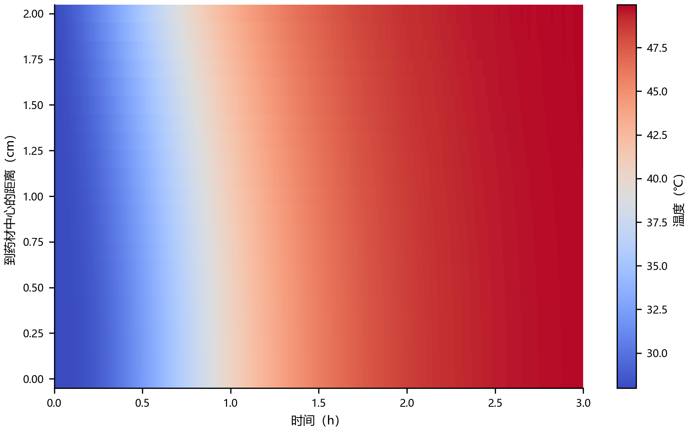
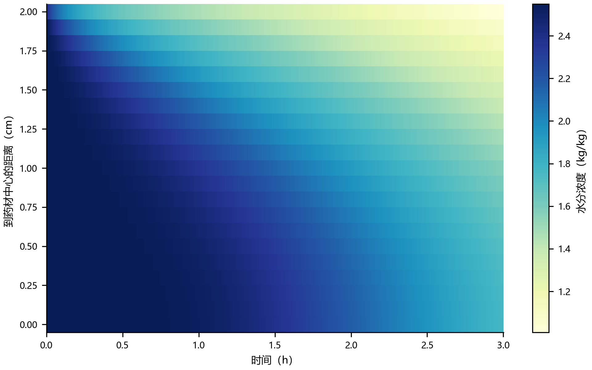
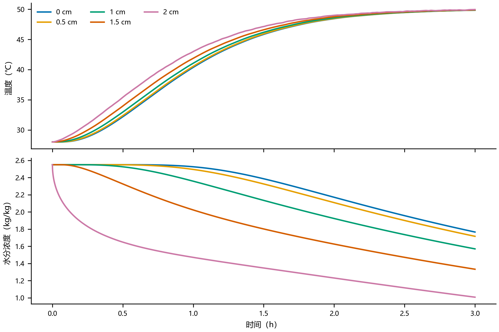
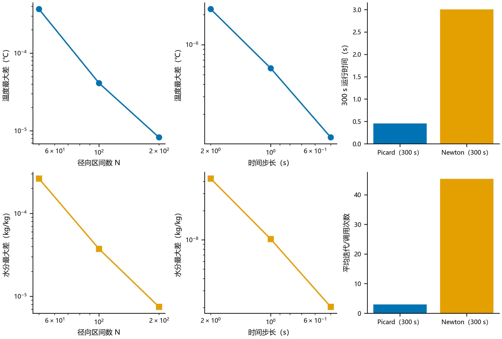

# 问题二：整个烘干过程的热湿耦合模型

## 1 问题分析

问题一把药材的物性参数近似为常数，只适用于烘干初期。随着含水率下降，药材的密度、比热容、导热系数和水分扩散系数都会改变，因此问题二需要在同一径向网格上同步求解温度场和水分场，并在每个时间步根据当前温度和水分浓度更新物性。

药材半径仍取 2 cm。题目把尺寸收缩单独放在问题四处理，因此问题二不使用附件 2。附件 1 提供 0–4 h 的烘房实测温度和水分浓度，第二问要求的前 3 h 完全位于这段实测区间内，边界值由相邻观测点线性插值得到。完整模型在 4 h 后转入恒温干燥阶段，烘房温度和水分浓度分别取 50 ℃ 和 0.05 kg/kg。

## 2 模型假设

1. 药材视为轴对称长圆柱，轴向和周向差异忽略，只研究径向传递。
2. 问题二中半径固定为 0.02 m，不考虑收缩。
3. 药材内部不存在体热源和水分源，热量由表面对流传入，水分由表面对流传出。
4. 对流换热系数取 25 W/(m²·K)，对流传质系数取 8×10⁻⁷ m/s，与附录二一致。
5. 温度和水分通过随状态变化的物性参数相互耦合。

## 3 热湿耦合模型

设 T(r,t) 为温度，C(r,t) 为干基水分浓度。控制方程为：

```text
ρ(C) cp(C) ∂T/∂t = (1/r) ∂[r k(C) ∂T/∂r]/∂r

∂C/∂t = (1/r) ∂[r D(T,C) ∂C/∂r]/∂r
```

附录三给出的变物性关系写为：

```text
ρ(C)  = 650 + 128 C
cp(C) = 1450 + 2736 C/(C+1)
k(C)  = 0.21 + 0.38 C/(C+1)
D(T,C)= 2.4×10⁻³ exp(-0.45/C) exp[-3850/(T+273.15)]
```

其中扩散系数公式内的温度必须用 K，程序输入的摄氏温度通过 T+273.15 转换。

圆柱中心满足对称条件，表面满足对流边界：

```text
r=0:  ∂T/∂r = 0，∂C/∂r = 0

r=R:  k ∂T/∂r = h(T∞-Ts)
      D ∂C/∂r = hm(C∞-Cs)
```

初始条件为 T(r,0)=28 ℃，C(r,0)=2.55 kg/kg。

## 4 数值求解

径向采用守恒型有限体积法，内部划分为 200 个区间，即空间步长 0.0001 m；时间采用 Crank–Nicolson 格式，步长 0.5 s。每个时间步使用 Picard 迭代同步更新温度、水分和四项物性，归一化迭代误差小于 10⁻¹⁰ 时停止。正式结果每 1 s 存储一次，并线性抽取题目要求的 0.1 cm 输出位置。

为检查非线性求解的可靠性，另用 Newton 法计算前 300 s。两种算法的最大结果差为 2.35×10⁻¹³，达到浮点舍入量级；Picard 用时 0.45 s，Newton 用时 3.01 s，因此正式计算选择结果相同但效率更高的 Picard 法。

## 5 计算结果

### 5.1 三小时内药材温度

单位：℃。

| 时间/h | 0 cm | 0.5 cm | 1 cm | 1.5 cm | 2 cm |
| ---: | ---: | ---: | ---: | ---: | ---: |
| 0.5 | 32.1892 | 32.3821 | 32.9659 | 33.9608 | 35.4130 |
| 1.0 | 40.3816 | 40.5536 | 41.0605 | 41.8782 | 42.9976 |
| 1.5 | 45.8468 | 45.9348 | 46.1930 | 46.6051 | 47.1401 |
| 2.0 | 48.4502 | 48.4881 | 48.5984 | 48.7736 | 49.0033 |
| 2.5 | 49.4670 | 49.4792 | 49.5137 | 49.5653 | 49.6609 |
| 3.0 | 49.8495 | 49.8553 | 49.8746 | 49.9101 | 49.9664 |



0.5 h 时表面温度为 35.4130 ℃，中心仅为 32.1892 ℃，表面—中心温差达到 3.2238 ℃，说明热量首先从表面向内部传递。到 3 h 时，表面和中心温度分别达到 49.9664 ℃ 和 49.8495 ℃，二者只差 0.1169 ℃，药材温度已基本接近均匀。

附件 1 在接近 50 ℃ 后存在小幅测量波动，因此约 0.99% 的时刻出现极小的局部反向温差，最大仅 0.00049 ℃。这不是计算发散，而是边界温度短时回落后的正常热惯性响应。

### 5.2 三小时内药材水分浓度

单位：kg/kg。

| 时间/h | 0 cm | 0.5 cm | 1 cm | 1.5 cm | 2 cm |
| ---: | ---: | ---: | ---: | ---: | ---: |
| 0.5 | 2.5499 | 2.5489 | 2.5256 | 2.3257 | 1.6486 |
| 1.0 | 2.5257 | 2.4948 | 2.3578 | 2.0230 | 1.4711 |
| 1.5 | 2.3861 | 2.3256 | 2.1344 | 1.8020 | 1.3476 |
| 2.0 | 2.1708 | 2.1084 | 1.9236 | 1.6259 | 1.2311 |
| 2.5 | 1.9566 | 1.9006 | 1.7360 | 1.4720 | 1.1166 |
| 3.0 | 1.7662 | 1.7165 | 1.5702 | 1.3333 | 1.0081 |



水分变化明显慢于温度变化。0.5 h 时中心水分浓度仍为 2.5499 kg/kg，几乎保持初值，而表面已降至 1.6486 kg/kg。到 3 h 时，中心和表面分别为 1.7662 kg/kg 和 1.0081 kg/kg，相对初值分别下降约 30.7% 和 60.5%，内部仍存在明显的湿芯。该结果表明，前三小时药材已接近热平衡，但远未达到水分平衡，后续烘干时长主要由内部水分向外扩散控制。



## 6 数值可靠性检验

将正式解与更细网格 N=400 比较，N=200 在指定表格点的温度最大差为 8.25×10⁻⁶ ℃，水分最大差为 7.47×10⁻⁶ kg/kg。将正式时间步 0.5 s 与 0.25 s 比较，两者最大差分别为 1.17×10⁻⁷ ℃ 和 2.04×10⁻⁹ kg/kg，说明当前网格和时间步已经足够精细。

全程最大代数残差为 3.57×10⁻¹³；单步热量闭合误差为 2.29×10⁻¹⁴ ℃ 等效量，单步水分闭合误差为 1.75×10⁻¹⁵ kg/kg。所有温度和水分值均为有限数，未出现负水分或越界温度。



## 7 结论

建立的变物性热湿耦合模型能够描述整个烘干过程，并通过 4 h 前实测边界、4 h 后恒定边界连接两个阶段。前三小时内，温度扰动很快传遍整个截面，药材由 28 ℃ 升至约 50 ℃；水分迁移则明显滞后，表层先干而中心保持较高含水率。温度过程接近完成而水分过程仍处于扩散控制阶段，这一时间尺度差异为问题三计算总烘干时间提供了模型基础。

完整的 1 s×0.1 cm 结果见 `results/result2.xlsx`，复现代码为 `code/q2_solver.py`。
