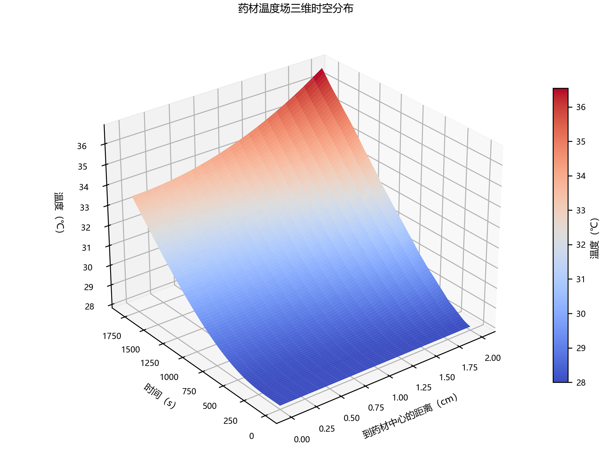

# 2026 数学建模 A 题——问题一、问题二计算结果

## 问题二

问题二已完成变物性热湿耦合求解。正式方法为守恒型径向有限体积法、Crank–Nicolson 时间推进和 Picard 非线性迭代，内部采用 `N=200`、`dt=0.5 s`，按题目要求输出每 1 s、每 0.1 cm 的完整结果。

- 论文正文：[Q2_paper_section.md](Q2_paper_section.md)
- 结果说明：[Q2_results_guide.md](Q2_results_guide.md)
- 提交表格：[results/result2.xlsx](results/result2.xlsx)
- 求解代码：[code/q2_solver.py](code/q2_solver.py)

运行：

```powershell
python code/q2_solver.py
```

以下原有内容为问题一结果。

本目录包含问题一的 Crank–Nicolson（CN）正式结果、后向欧拉（BE）对照结果、论文用中文图片、表格和可复现代码。

## 最终结论

- 正式方案：一维圆柱径向有限体积法 + Crank–Nicolson。
- 内部计算：径向区间数 `N=800`，时间步长 `0.125 s`。
- 原后向欧拉结果保留作对照。
- CN 结果与参考截图的 35 个温度点最大差为 `5.58e-5 ℃`，水分最大差为 `6.46e-5 kg/kg`。

问题一正文见：[问题一_论文正文.md](问题一_论文正文.md)。补充计算说明见：[问题1_结果说明.md](问题1_结果说明.md) 和 [问题1_CN与后向欧拉差异分析.md](问题1_CN与后向欧拉差异分析.md)。

## 论文正文图片

### 温度场


二维时空图采用“低温蓝—高温红”渐变。另提供三维展示图：



二维三联图用于正文，三维曲面用于附录或答辩展示。

### 水分场


其余论文可用图片：

- `figures/raw_q1_temperature_interpolation_detailed.*`：烘房温度插值精细比较（含局部差值面板，正文推荐）。
- `figures/raw_q1_moisture_interpolation_detailed.*`：烘房水分浓度插值精细比较（含局部差值面板，正文推荐）。
- `figures/raw_q1_*_interpolation.*`：原始插值图，保留作对照。
- `figures/process_q1_be_cn_difference.*`：BE 与 CN 差异。
- `figures/process_q1_cn_convergence.*`：网格与时间步收敛。
- `figures/process_q1_surface_center_gap.*`：表面—中心温差和含水率差的形成过程。

每张图均提供 PNG（直接插入 Word）和 SVG（矢量编辑）两个版本。

## 结果表格

- `results/result1.xlsx`：最终提交用 CN 结果。
- `results/result1_CN.xlsx`：CN 结果留档。
- `results/result1_BE.xlsx`：后向欧拉结果留档。
- `results/问题1_CN_指定时刻温度.csv`：论文温度表。
- `results/问题1_CN_指定时刻水分浓度.csv`：论文水分表。
- `results/问题1_CN收敛性.csv`：收敛性表。
- `results/问题1_差异来源量化.csv`：差异来源表。
- `results/问题1_边界插值比较.csv`：插值方法评价表。

## 代码

全部代码位于 `code/`。安装依赖后，在仓库根目录运行：

```powershell
python -m pip install -r requirements.txt
python code/q1_solver.py
```

仅重新生成论文中文图片：

```powershell
python code/make_paper_figures.py
```

运行主程序约需 1–2 分钟。程序读取 `data/`，并把结果写入 `results/`、图片写入 `figures/`。

## 目录说明

```text
code/       全部 Python 代码
data/       问题一所需输入与输出模板
figures/    论文用中文 PNG/SVG
results/    Excel、CSV 和校验摘要
```
