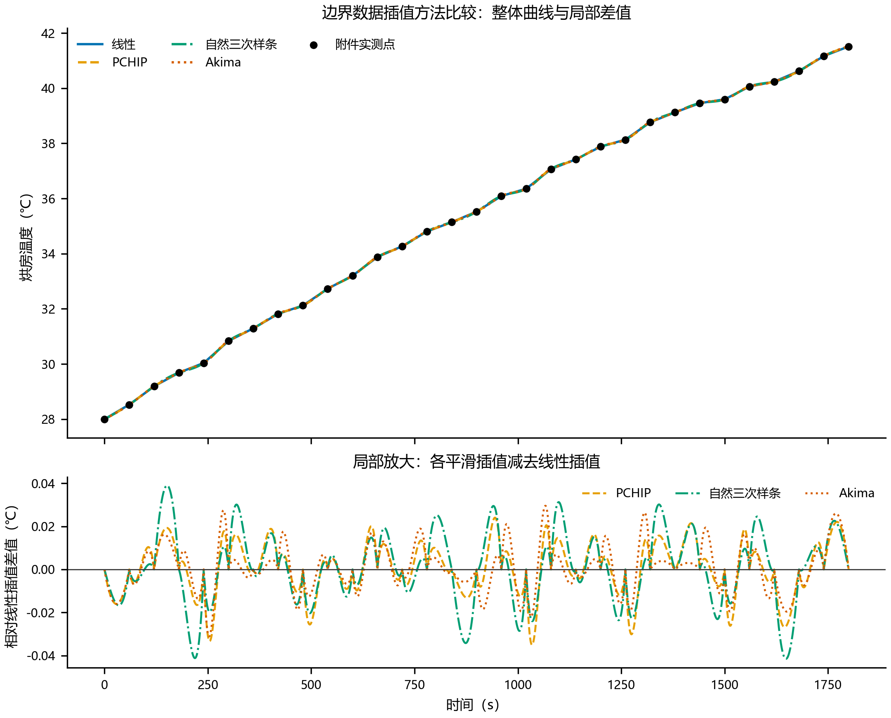
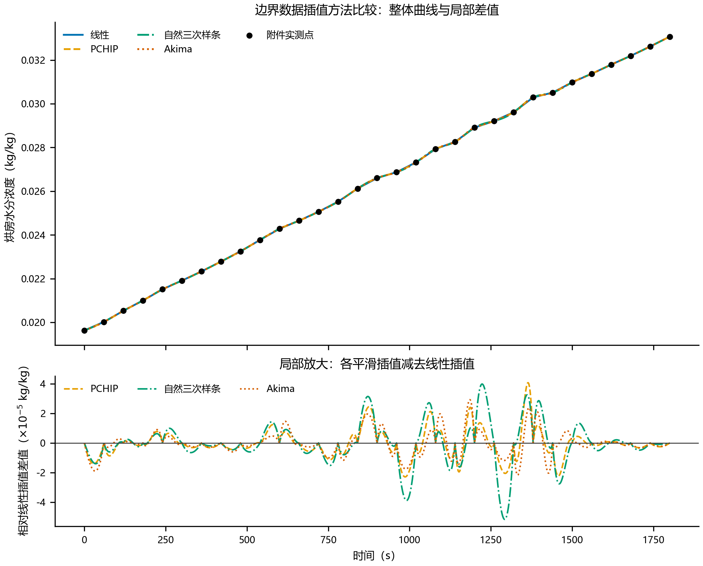
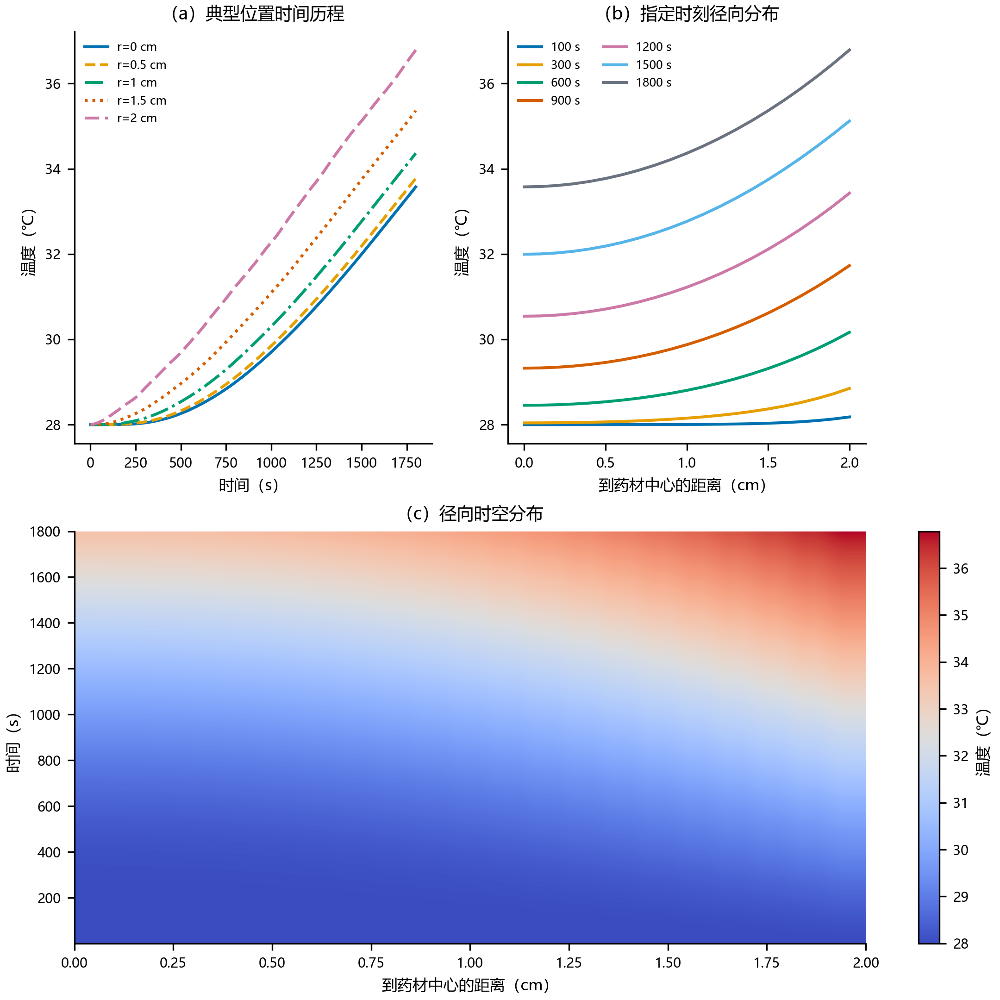
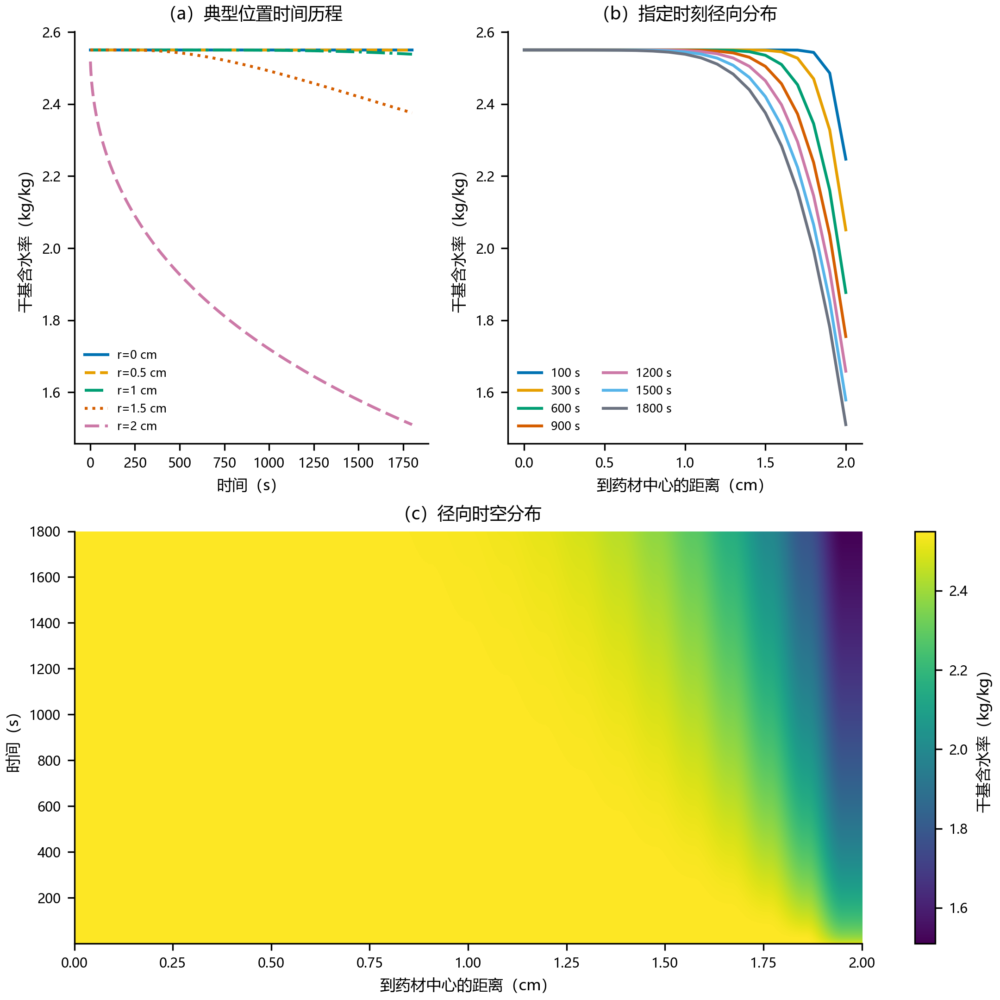
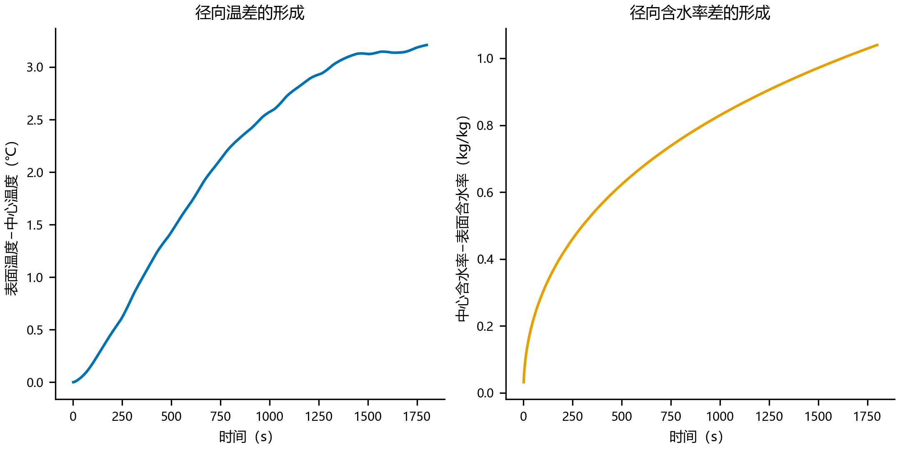
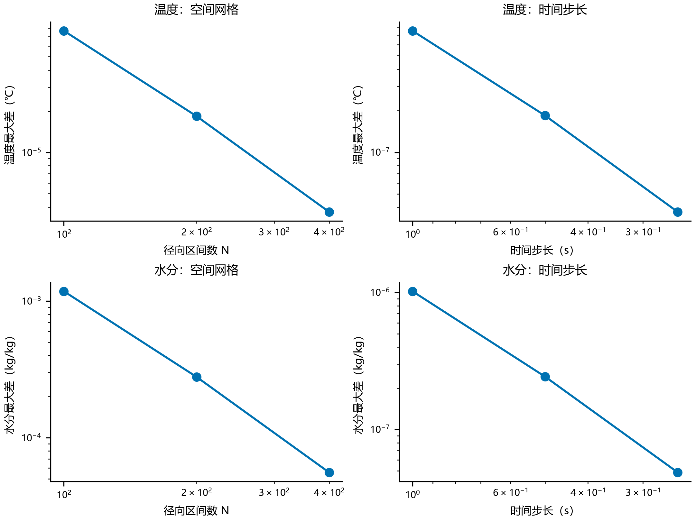
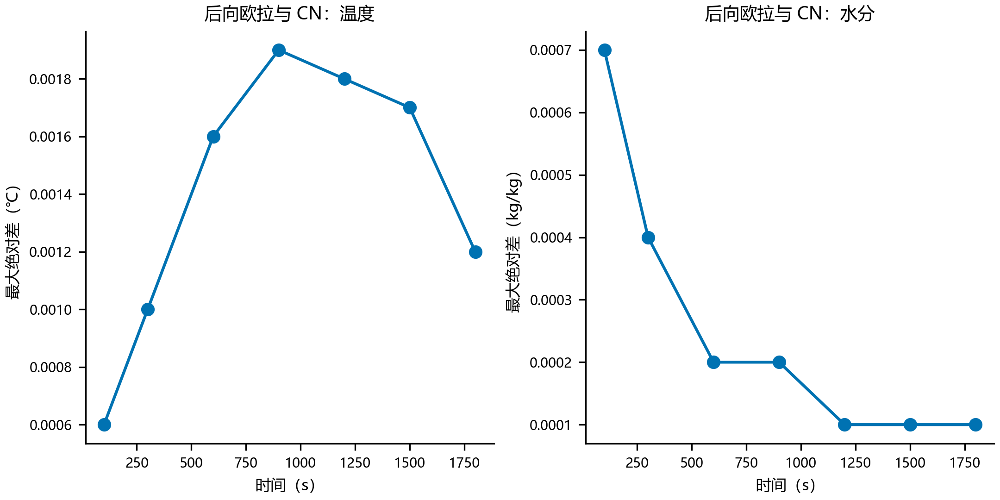

# 问题一：预热平衡阶段药材温度与水分浓度分布

## 1 问题分析

预热平衡阶段持续 1800 s，药材半径保持为 2 cm，烘房温度及空气水分浓度随时间变化。由于药材长度为 25 cm、半径仅为 2 cm，长径比较大，端面对中部截面的影响相对较弱，故将药材简化为无限长圆柱，并仅考虑径向传热传质。热量由表面向中心传入，水分则由内部向表面迁移，两种传递过程均具有明显的空间梯度，不能将药材视作温度和含水率处处相同的集中参数系统。

据此，建立一维圆柱径向导热—非线性水分扩散模型。空间离散采用节点中心有限体积法，以保证离散层面的通量守恒；时间推进采用 Crank–Nicolson 格式，以减小原后向欧拉方法的时间离散误差。模型输出 0～1800 s 内药材内部的完整温度场与水分场，并提取题目指定时刻和径向位置的数值。

## 2 模型假设

1. 药材为均匀、各向同性的长圆柱，忽略端面效应，研究对象代表圆柱中部截面；
2. 预热阶段药材半径固定为 $R=0.02\ \mathrm m$，不引入后续干燥阶段的体积收缩；
3. 初始温度与初始干基含水率在药材内部均匀分布；
4. 密度、比热容、导热系数以及表面对流换热、传质系数在本阶段取题设常数；
5. 水分有效扩散系数随局部干基含水率变化；
6. 在缺少药材吸附等温线的条件下，将附件中的空气水分浓度作为等效传质边界值；
7. 本阶段忽略水分蒸发潜热对温度场的反作用，温度方程与水分方程分别求解。

## 3 符号与参数

| 符号 | 含义 | 数值或表达式 | 单位 |
|---|---|---:|---|
| $r$ | 到药材中心轴的径向距离 | $0\le r\le R$ | m |
| $t$ | 预热开始后的时间 | $0\le t\le1800$ | s |
| $R$ | 药材半径 | 0.02 | m |
| $T(r,t)$ | 药材内部温度 | — | ℃ |
| $C(r,t)$ | 药材干基含水率 | — | kg/kg |
| $T_a(t)$ | 烘房空气温度 | 附件 1 插值得到 | ℃ |
| $C_b(t)$ | 等效边界水分浓度 | 附件 1 插值得到 | kg/kg |
| $\rho$ | 药材密度 | 820 | kg/m³ |
| $c_p$ | 药材比热容 | 2600 | J/(kg·K) |
| $k$ | 药材导热系数 | 0.36 | W/(m·K) |
| $h$ | 表面对流换热系数 | 25 | W/(m²·K) |
| $h_m$ | 表面对流传质系数 | $8\times10^{-7}$ | m/s |
| $D(C)$ | 水分有效扩散系数 | $7\times10^{-9}e^{-0.89/C}$ | m²/s |

## 4 边界数据处理

附件 1 在 0～1800 s 内每隔 60 s 给出一次烘房温度和空气水分浓度，而数值计算需要获得任意时间步上的边界值。为选择合适的插值方法，分别采用线性插值、PCHIP、自然三次样条和 Akima 方法重构边界曲线，并通过内部留一法评价插值误差。

*图 1　烘房温度边界数据插值方法比较。上图为整体变化曲线，下图为各平滑插值相对线性插值的局部差值。*

*图 2　烘房水分浓度边界数据插值方法比较。黑点为附件观测值，下图纵轴将微小差值放大 $10^5$ 倍显示。*

由图 1、图 2 可见，四种方法在完整量程下几乎重合，但局部差值并非为零。温度插值曲线相对线性插值的最大差为 0.04150 ℃，水分浓度的最大差为 $5.16\times10^{-5}\ \mathrm{kg/kg}$。内部留一检验结果见表 1。

**表 1　边界数据插值方法的内部留一检验**

| 变量 | 方法 | MAE | RMSE | 最大绝对误差 |
|---|---|---:|---:|---:|
| 温度/℃ | 线性 | 0.112776 | 0.125051 | 0.225000 |
| 温度/℃ | PCHIP | 0.134174 | 0.145798 | 0.256795 |
| 温度/℃ | 自然三次样条 | 0.158313 | 0.172509 | 0.285107 |
| 温度/℃ | Akima | 0.124942 | 0.135341 | 0.247504 |
| 水分/(kg/kg) | 线性 | $6.3793\times10^{-5}$ | $8.6533\times10^{-5}$ | $2.3000\times10^{-4}$ |
| 水分/(kg/kg) | PCHIP | $6.6159\times10^{-5}$ | $9.3722\times10^{-5}$ | $2.4003\times10^{-4}$ |
| 水分/(kg/kg) | 自然三次样条 | $6.9525\times10^{-5}$ | $9.8050\times10^{-5}$ | $2.3668\times10^{-4}$ |
| 水分/(kg/kg) | Akima | $6.4430\times10^{-5}$ | $8.9791\times10^{-5}$ | $2.3401\times10^{-4}$ |

线性插值对两类边界数据均取得最小 MAE 和 RMSE，同时未发生区间过冲，故后续计算采用分段线性插值得到 $T_a(t)$ 与 $C_b(t)$。

## 5 模型建立

### 5.1 温度控制方程

在半径为 $r$、厚度为 $\mathrm dr$ 的圆环微元上进行能量守恒分析。忽略轴向传热与内部热源，根据 Fourier 定律可得圆柱径向导热方程

$$
\rho c_p\frac{\partial T}{\partial t}
=\frac{1}{r}\frac{\partial}{\partial r}
\left(rk\frac{\partial T}{\partial r}\right).
\qquad\text{(1)}
$$

### 5.2 水分控制方程

水分在药材内部以扩散方式迁移。根据 Fick 定律，并考虑有效扩散系数随含水率变化，得到

$$
\frac{\partial C}{\partial t}
=\frac{1}{r}\frac{\partial}{\partial r}
\left[rD(C)\frac{\partial C}{\partial r}\right],
\qquad\text{(2)}
$$

其中

$$
D(C)=7\times10^{-9}\exp\left(-\frac{0.89}{C}\right).
\qquad\text{(3)}
$$

### 5.3 初始条件与边界条件

药材的初始温度与干基含水率分别为

$$
T(r,0)=28\ ^\circ\mathrm C,\qquad
C(r,0)=2.55\ \mathrm{kg/kg}.
\qquad\text{(4)}
$$

圆柱中心满足轴对称零通量条件

$$
\left.\frac{\partial T}{\partial r}\right|_{r=0}=0,
\qquad
\left.\frac{\partial C}{\partial r}\right|_{r=0}=0.
\qquad\text{(5)}
$$

药材表面同时与烘房空气发生对流换热和传质，采用第三类边界条件

$$
-k\left.\frac{\partial T}{\partial r}\right|_{r=R}
=h\left[T(R,t)-T_a(t)\right],
\qquad\text{(6)}
$$

$$
-D(C)\left.\frac{\partial C}{\partial r}\right|_{r=R}
=h_m\left[C(R,t)-C_b(t)\right].
\qquad\text{(7)}
$$

## 6 数值求解

### 6.1 径向有限体积离散

在 $[0,R]$ 上布置 $N+1$ 个等距节点 $r_i=i\Delta r$。节点 $i$ 对应的环形控制体面积因子为

$$
V_i=\frac12\left(r_{i+1/2}^{2}-r_{i-1/2}^{2}\right).
\qquad\text{(8)}
$$

将温度和水分方程统一写成

$$
\beta\frac{\partial u}{\partial t}
=\frac1r\frac{\partial}{\partial r}
\left(r\Gamma\frac{\partial u}{\partial r}\right),
\qquad\text{(9)}
$$

其中温度方程对应 $(u,\beta,\Gamma)=(T,\rho c_p,k)$，水分方程对应 $(u,\beta,\Gamma)=(C,1,D(C))$。对控制体积分后，内部节点满足

$$
\beta V_i\frac{\mathrm du_i}{\mathrm dt}
=G_{i-1/2}(u_{i-1}-u_i)
+G_{i+1/2}(u_{i+1}-u_i),
\qquad\text{(10)}
$$

式中 $G_{i+1/2}=r_{i+1/2}\Gamma_{i+1/2}/\Delta r$。水分扩散系数在控制体界面取调和平均，以减小扩散系数空间变化造成的通量误差。中心控制体的内侧通量为零；表面控制体的外侧通量分别由式（6）、式（7）直接给出，因而无须构造虚拟节点。

### 6.2 Crank–Nicolson 时间推进

空间离散后记半离散算子为 $L$，边界源项为 $s$，Crank–Nicolson 格式为

$$
\left(I-\frac{\Delta t}{2}L^{n+1}\right)u^{n+1}
=\left(I+\frac{\Delta t}{2}L^n\right)u^n
+\frac{\Delta t}{2}\left(s^{n+1}+s^n\right).
\qquad\text{(11)}
$$

温度方程的物性参数为常数，每个时间步只需求解一次三对角线性方程组。水分方程中的 $D(C)$ 依赖未知的 $C^{n+1}$，因此采用 Picard 迭代：先以旧时刻含水率作为初值，更新扩散系数后求解式（11），直至相邻两次迭代的最大节点差小于 $10^{-11}\ \mathrm{kg/kg}$。正式计算中每个时间步最多迭代 4 次。

计算采用

$$
N=800,\qquad
\Delta r=2.5\times10^{-5}\ \mathrm m=0.0025\ \mathrm{cm},
\qquad
\Delta t=0.125\ \mathrm s.
\qquad\text{(12)}
$$

内部计算完成后，按每 1 s 和每 0.1 cm 提取结果写入题目规定的 Excel 模板。

## 7 结果与分析

### 7.1 温度场

**表 2　预热阶段药材内部温度**　单位：℃

| 时间/s | 0 cm | 0.5 cm | 1 cm | 1.5 cm | 2 cm |
|---:|---:|---:|---:|---:|---:|
| 100 | 28.0001 | 28.0003 | 28.0040 | 28.0327 | 28.1801 |
| 300 | 28.0408 | 28.0635 | 28.1514 | 28.3681 | 28.8489 |
| 600 | 28.4533 | 28.5360 | 28.8039 | 29.3159 | 30.1652 |
| 900 | 29.3243 | 29.4583 | 29.8755 | 30.6161 | 31.7304 |
| 1200 | 30.5427 | 30.7098 | 31.2223 | 32.1126 | 33.4276 |
| 1500 | 31.9957 | 32.1867 | 32.7660 | 33.7463 | 35.1203 |
| 1800 | 33.5753 | 33.7720 | 34.3642 | 35.3621 | 36.7856 |

*图 3　预热阶段药材内部温度的时空演化。*

表 2 和图 3 表明，各径向位置的温度均随时间升高，且同一时刻表面温度高于中心温度。100 s 时中心温度仍为 28.0001 ℃，表面已升至 28.1801 ℃；1800 s 时二者分别达到 33.5753 ℃和 36.7856 ℃，表面—中心温差为 3.2103 ℃。中心温度持续上升说明在 30 min 的预热过程中，热扰动已经传至药材中心，但内部仍未与表面达到热平衡。

### 7.2 水分场

**表 3　预热阶段药材内部干基含水率**　单位：kg/kg

| 时间/s | 0 cm | 0.5 cm | 1 cm | 1.5 cm | 2 cm |
|---:|---:|---:|---:|---:|---:|
| 100 | 2.5500 | 2.5500 | 2.5500 | 2.5500 | 2.2471 |
| 300 | 2.5500 | 2.5500 | 2.5500 | 2.5492 | 2.0508 |
| 600 | 2.5500 | 2.5500 | 2.5500 | 2.5353 | 1.8770 |
| 900 | 2.5500 | 2.5500 | 2.5497 | 2.5045 | 1.7547 |
| 1200 | 2.5500 | 2.5500 | 2.5482 | 2.4646 | 1.6586 |
| 1500 | 2.5500 | 2.5499 | 2.5445 | 2.4206 | 1.5787 |
| 1800 | 2.5500 | 2.5497 | 2.5383 | 2.3755 | 1.5102 |

*图 4　预热阶段药材内部干基含水率的时空演化。*

表 3 和图 4 显示，水分迁移明显慢于热量传递。100 s 时表面含水率已降至 2.2471 kg/kg，而 0～1.5 cm 范围内四舍五入后仍保持初值。1800 s 时表面含水率进一步降至 1.5102 kg/kg，距中心 1.5 cm 处为 2.3755 kg/kg，但中心仍为 2.5500 kg/kg。这说明预热阶段的失水主要集中在表层，尚未深入影响圆柱中心。

*图 5　预热过程中表面与中心温度差及含水率差的形成。*

图 5 进一步给出了径向梯度随时间的变化。表面—中心温差总体由 0 增至 3.2103 ℃，中心—表面含水率差由近零增至 1.0398 kg/kg。温度差在后期趋于平缓，而含水率差仍持续增大，反映出传热与传质时间尺度的显著差异。

## 8 模型检验与可信度说明

本题附件只给出了烘房环境温度和空气水分浓度，没有给出药材内部温度、含水率的同步实测值。因此，本文采用“数值收敛—方程实现—解析退化—物理合理性—外部结果复核”五层检验链：先确认网格和时间步足够细，再检查离散方程是否被准确求解、热量和水分通量是否守恒；随后将模型退化到存在解析解的简单情形进行对照，并检查正式工况下结果是否满足基本物理规律；最后与用户提供的独立计算截图逐点比较。前四层用于验证程序与数值模型的可靠性，第五层属于跨实现复核，均不能替代真实内部测量数据下的实验验证。

### 8.1 网格与时间步收敛性

以更细设置为参照，分别改变径向区间数和时间步长，得到表 4 所示最大绝对差。

**表 4　Crank–Nicolson 格式的网格与时间步收敛性**

| 检查类型 | 较粗设置 | 温度最大差/℃ | 水分最大差/(kg/kg) |
|---|---:|---:|---:|
| 空间网格 | $N=100$ | $7.73\times10^{-5}$ | $1.18\times10^{-3}$ |
| 空间网格 | $N=200$ | $1.84\times10^{-5}$ | $2.79\times10^{-4}$ |
| 空间网格 | $N=400$ | $3.68\times10^{-6}$ | $5.56\times10^{-5}$ |
| 时间步长 | 1.0 s | $7.59\times10^{-7}$ | $1.02\times10^{-6}$ |
| 时间步长 | 0.5 s | $1.84\times10^{-7}$ | $2.43\times10^{-7}$ |
| 时间步长 | 0.25 s | $3.70\times10^{-8}$ | $4.86\times10^{-8}$ |

*图 6　径向网格和时间步长收敛性检验。*

由表 4 和图 6 可见，随着径向网格加密和时间步缩小，温度与水分结果均稳定收敛。网格数或时间步每加密一倍，最大误差约缩小至原来的 $1/4$～$1/5$，呈现接近二阶收敛的趋势，与中心有限体积空间离散和 CN 时间格式的理论精度相符。CN 格式的时间误差已经很小，剩余误差主要来自水分表层薄变化区的空间离散。采用 $N=800$、$\Delta t=0.125\ \mathrm s$ 后，结果足以稳定支撑题目要求的四位小数输出。

### 8.2 守恒性、物理性与解析退化检验

本轮从原始附件重新运行完整程序，耗时 79.88 s，各项自动检查均通过。完整时空结果没有 NaN 或无穷值，温度范围为 28.0000～36.7856 ℃，干基含水率范围为 1.5102～2.5500 kg/kg；温度由中心向表面单调升高，含水率由中心向表面单调降低，符合热量由表面传入、水分由表面迁出的物理方向。非线性水分方程的 Picard 迭代在所有时间步均收敛，单步最多迭代 4 次。

CN 求解中，三对角线性系统的最大残差为 $6.68\times10^{-13}$，面积平均温度的累计等效平衡残差为 $5.82\times10^{-11}\ ^\circ\mathrm C$，面积平均含水率的累计平衡残差为 $1.54\times10^{-14}\ \mathrm{kg/kg}$。这些残差接近机器舍入误差，说明每个时间步的代数方程得到充分求解，有限体积离散中的热量和水分通量在数值上闭合。

进一步将模型退化为常物性、恒定边界条件下的圆柱扩散问题，并与 Bessel 级数解析解比较。温度和水分的最大绝对差分别为 $3.21\times10^{-5}\ ^\circ\mathrm C$ 和 $1.26\times10^{-4}\ \mathrm{kg/kg}$。该检验具有已知标准答案，可同时核对圆柱坐标项、中心对称条件、表面对流条件和 CN 时间推进的代码实现，结果表明求解器实现正确。

### 8.3 外部结果复核与验证边界

将本模型结果与用户提供的另一份计算结果截图进行 35 个温度点和 35 个含水率点的逐点比较，最大绝对差分别为 $5.58\times10^{-5}\ ^\circ\mathrm C$ 和 $6.46\times10^{-5}\ \mathrm{kg/kg}$，四位小数层面基本一致。这说明在相同题目数据和近似物理假设下，不同实现能够得到可重复的结果，但截图不是药材内部的实验测量值，因而只能作为跨实现复核，不能作为实验验证。

综上，本文已经验证了数值离散、程序实现、守恒关系和结果的基本物理合理性，可以支持问题一的数值预测；但材料参数及边界传质关系是否精确反映真实药材，仍需内部温度与含水率实测数据进行外部验证。论文后续结论据此限定为“模型计算可信”，不表述为“已经由实验数据证明完全准确”。

## 9 数值方案差异分析

为解释原后向欧拉结果与参考结果之间约 0.00几的差异，在其余条件保持一致时，分别改变时间离散方法、空间网格、界面扩散系数平均方式和边界插值方法，结果见表 5。

**表 5　不同数值设置引起的最大结果差异**

| 差异来源 | 温度最大变化/℃ | 水分最大变化/(kg/kg) |
|---|---:|---:|
| 后向欧拉与 CN（$N=200,\Delta t=1\ \mathrm s$） | 0.001910 | 0.000411 |
| $N=200$ 与 $N=800$（固定 $\Delta t=0.25\ \mathrm s$） | 0.000018 | 0.000279 |
| 界面扩散系数采用算术平均与调和平均 | 0 | 0.000001 |
| 边界采用 PCHIP 与线性插值 | 0.002320 | 0.000001 |

*图 7　后向欧拉与 Crank–Nicolson 在相同网格和时间步下的最大绝对差。*

表 5 与图 7 表明，原温度结果的系统性偏差主要来自时间离散方法和边界插值；水分结果除受时间格式影响外，还对表层薄变化区的径向网格密度较敏感。界面扩散系数的平均方式仅造成约 $10^{-6}$ kg/kg 的变化，不是主要差异来源。后向欧拉格式具有较强数值耗散，使快速变化过程略显迟钝；CN 格式为二阶时间精度，对边界变化的还原更细致，因此将其作为正式结果，后向欧拉仅保留为稳定性对照。

第 8.3 节的跨实现逐点复核进一步表明，采用 CN、细化网格和线性边界插值后，本模型与参考计算在四位小数层面基本一致。不同截图中个别数据的最后一位本身存在差别，因此该比较不参与模型参数标定，也不作为药材内部实测验证。

## 10 问题一结论

本文建立了固定半径圆柱药材的一维径向导热—非线性水分扩散模型，并采用守恒型有限体积法和 Crank–Nicolson 格式求解。1800 s 时，药材中心和表面温度分别为 33.5753 ℃和 36.7856 ℃，表面—中心温差达到 3.2103 ℃；中心和表面干基含水率分别为 2.5500 kg/kg 和 1.5102 kg/kg，中心—表面差达到 1.0398 kg/kg。计算结果说明，预热 30 min 后热扰动已传至圆柱中心，而水分扰动仍主要局限于表层。

网格收敛、时间步收敛、离散平衡、常系数解析退化和跨实现复核共同表明数值求解稳定可靠。与后向欧拉对照可知，约 0.001 ℃量级的温度差主要由时间离散精度造成，水分差异则同时受到时间格式和径向网格分辨率影响。这里得到的是数值模型可信性证据，而不是实测条件下的精度承诺。模型的主要适用边界在于：附件中的空气水分浓度被等效用作药材表面传质边界，且未计入蒸发潜热的反向耦合；若获得药材吸附等温线或内部温湿度实测数据，应进一步标定边界关系并开展外部验证。
