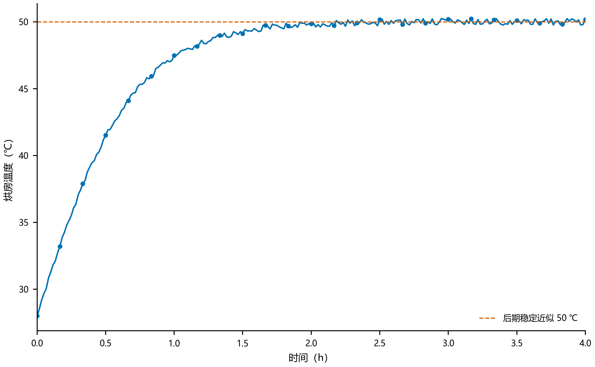
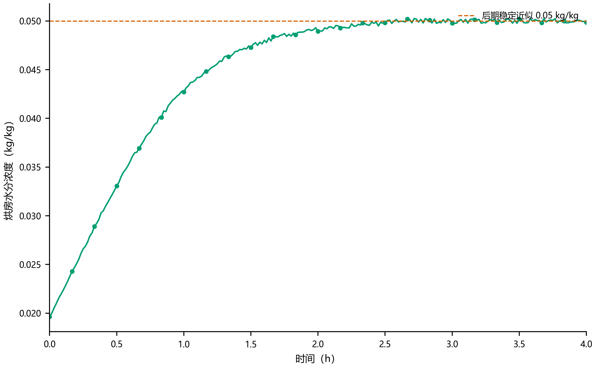
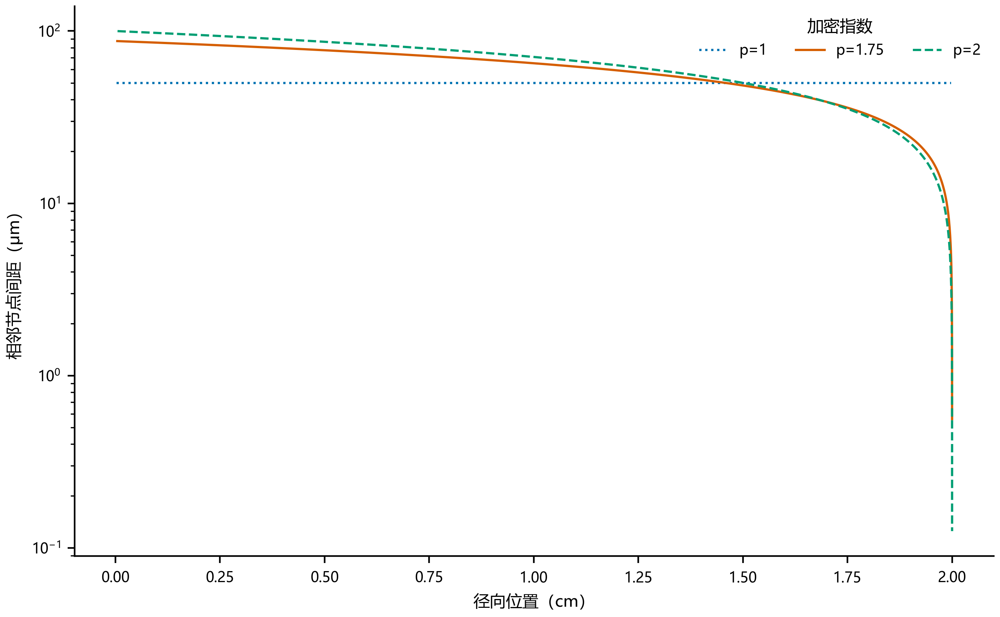
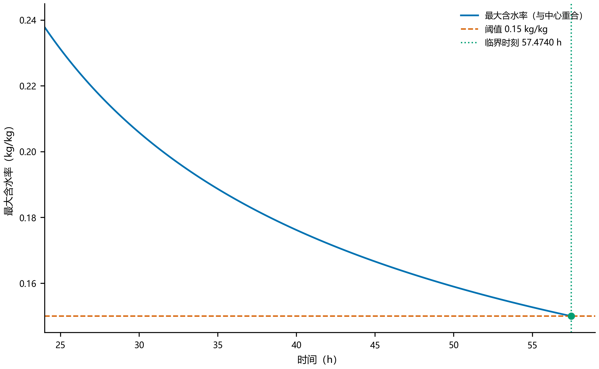
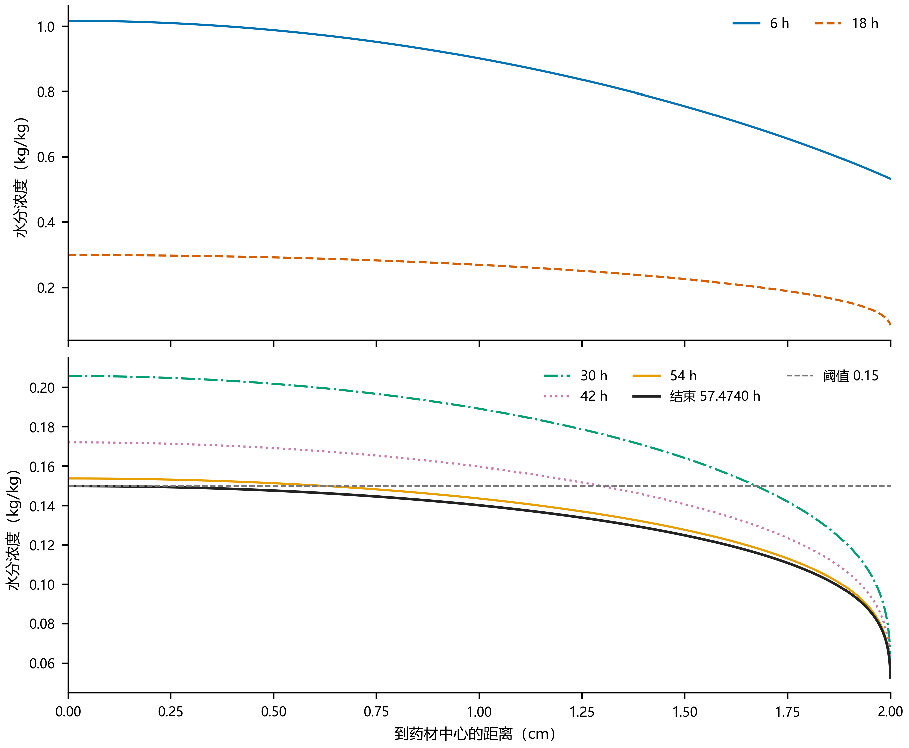
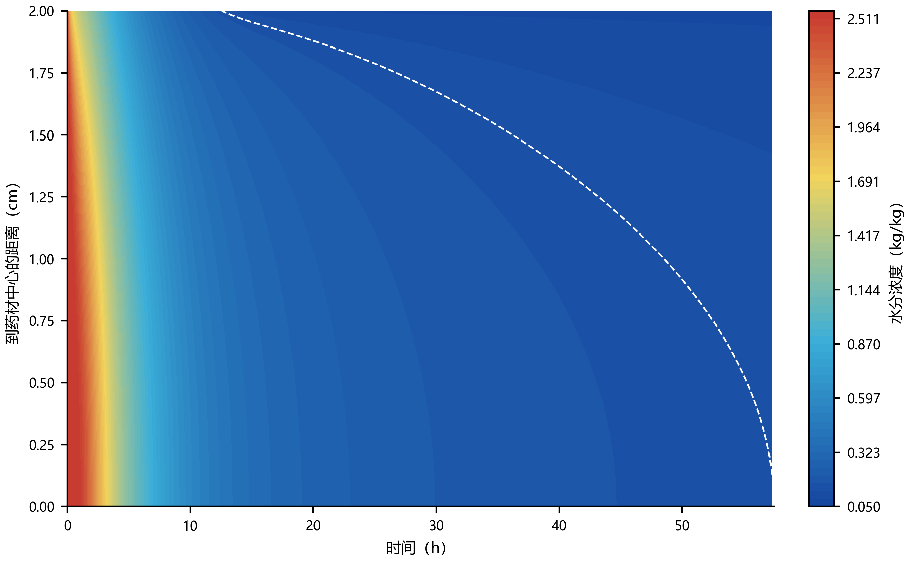
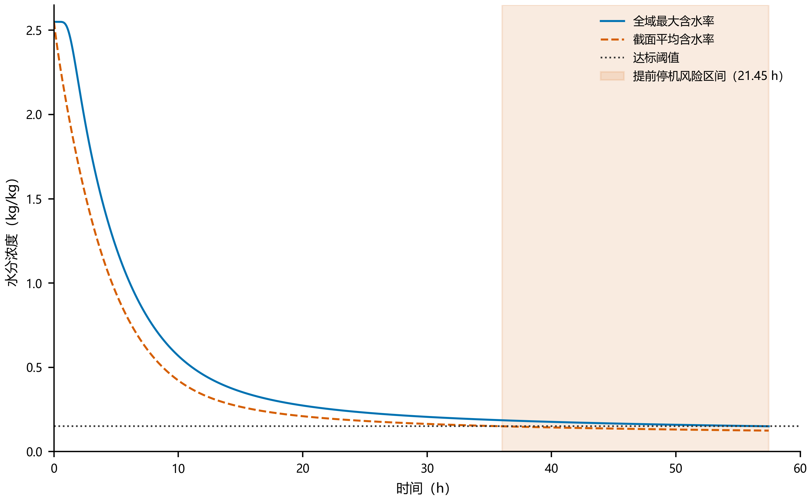
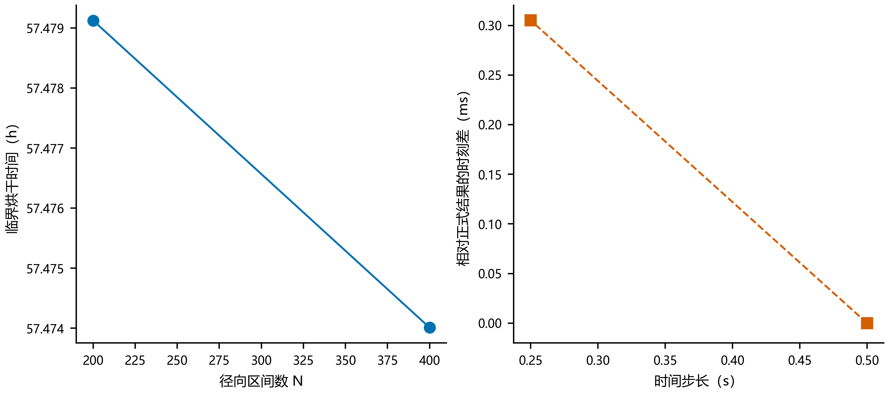

# 问题三：药材含水率全面达标时刻

## 1 问题分析

问题二已经建立固定半径圆柱药材的变物性热湿传递模型，并计算了前 3 h 的温度场与水分场。问题三不再改变物理模型，而是将同一初值问题继续向后推进，直至药材内部任意位置的干基含水率均低于 $0.15\ \mathrm{kg/kg}$。因此，本问的关键不只是延长计算时间，还需要准确处理三个问题：其一，题目中的“各处”必须转化为全空间约束，不能用截面平均值或表面值代替；其二，长期干燥会在表面形成较大的水分梯度，需要提高表层的空间分辨率；其三，终止时刻是一个阈值事件，需要在时间步内进一步定位。

为此，本文沿用问题二的变物性热湿模型，采用表面加密的节点中心有限体积法和 Crank–Nicolson 时间格式求解，并在每个时间步检查全部径向节点。计算得到连续模型的临界时刻为 $57.474009\ \mathrm h$。全过程数值检查表明，最大含水率始终位于圆柱中心，故中心湿芯是决定总烘干时间的控制位置；这是全节点计算得到的结果，而不是预先施加的假设。

## 2 模型承接与达标判据

### 2.1 控制方程与变物性关系

药材仍被视为半径 $R=0.02\ \mathrm m$ 的轴对称长圆柱，忽略轴向和周向变化，且本问不考虑问题四中的尺寸收缩。温度场 $T(r,t)$ 与干基含水率场 $C(r,t)$ 满足

$$
\rho(C)c_p(C)\frac{\partial T}{\partial t}
=\frac{1}{r}\frac{\partial}{\partial r}
\left[rk(C)\frac{\partial T}{\partial r}\right],
\tag{1}
$$

$$
\frac{\partial C}{\partial t}
=\frac{1}{r}\frac{\partial}{\partial r}
\left[rD(T,C)\frac{\partial C}{\partial r}\right].
\tag{2}
$$

其中，各项物性参数继续采用问题二中的经验关系

$$
\rho(C)=650+128C,
\qquad
c_p(C)=1450+\frac{2736C}{C+1},
\tag{3}
$$

$$
k(C)=0.21+\frac{0.38C}{C+1},
\tag{4}
$$

$$
D(T,C)=2.4\times10^{-3}
\exp\left(-\frac{0.45}{C}\right)
\exp\left[-\frac{3850}{T+273.15}\right].
\tag{5}
$$

式（5）中的温度按绝对温标换算。初始条件、中心对称条件和表面对流换热、传质条件均与问题二相同。

### 2.2 全域达标判据

定义时刻 $t$ 的全域最大含水率为

$$
C_{\max}(t)=\max_{0\le r\le R}C(r,t).
\tag{6}
$$

则药材全部位置达到要求的临界时刻定义为

$$
t^*=\inf\left\{t:C_{\max}(t)<0.15\right\}.
\tag{7}
$$

程序对所有径向节点取最大值，并在相邻时间层跨越阈值后采用二分法定位 $t^*$。二分区间的左端仍未严格达标，右端已经严格达标，区间宽度控制在 $10^{-4}\ \mathrm s$ 以内；程序以右端点作为保守停止时刻。只有在完成全过程最大值位置检查后，才能判断式（6）是否可等价为中心含水率。

### 2.3 外界环境的延拓

附件 1 给出了前 4 h 的烘房温度和空气水分浓度，计算时对相邻观测点作分段线性插值。附件数据在后期已趋近稳定，而题目未继续提供 4 h 之后的观测值，因此将后续环境延拓为

$$
T_{\infty}(t)=50\ ^\circ\mathrm C,
\qquad
C_{\infty}(t)=0.05\ \mathrm{kg/kg},
\qquad t>4\ \mathrm h.
\tag{8}
$$

*图 1　烘房温度边界及 4 h 后的稳定环境延拓。*

*图 2　烘房空气水分浓度边界及 4 h 后的稳定环境延拓。*

这里的恒定环境是根据附件末段变化趋势作出的建模延拓，并非题目提供了 57 h 的连续实测边界。后文的总烘干时间应在这一边界假设下理解。

## 3 数值求解

### 3.1 表面加密的径向有限体积网格

长期干燥阶段的水分变化主要集中在药材表层。为兼顾表层分辨率和总体计算量，在 $[0,R]$ 上采用非均匀节点

$$
r_i=R\left[1-\left(1-\frac{i}{N}\right)^p\right],
\qquad i=0,1,\ldots,N,
\tag{9}
$$

其中正式计算取 $N=400$、$p=1.75$。控制体边界取相邻节点中点，面积因子为

$$
V_i=\frac{1}{2}\left(r_{i+1/2}^2-r_{i-1/2}^2\right).
\tag{10}
$$

将温度方程和水分方程统一写为容量项 $\beta$、扩散系数 $\Gamma$ 下的径向扩散方程。对第 $i$ 个控制体积分后，有

$$
\beta_iV_i\frac{\mathrm du_i}{\mathrm dt}
=G_{i-1/2}(u_{i-1}-u_i)
+G_{i+1/2}(u_{i+1}-u_i),
\tag{11}
$$

其中 $G_{i+1/2}=r_{i+1/2}\Gamma_{i+1/2}/(r_{i+1}-r_i)$，界面系数采用相邻节点值的调和平均。中心控制体内侧通量为零，表面控制体的外侧通量由第三类边界条件直接给出。

*图 3　不同加密指数下的表层网格间距。*

初始方案取 $p=2$。当 $N=400$、$\Delta t=0.5\ \mathrm s$ 时，其最外层节点间距仅为 $0.125\ \mu\mathrm m$，Crank–Nicolson 格式在极薄表层单元上出现幅度很小的交替振荡。将指数缓和为 $p=1.75$ 后，最小节点间距增至 $0.559\ \mu\mathrm m$，全过程可检出的径向单调性破坏由 54567 个时间步降为 0，而临界时刻只改变 $1.8539\ \mathrm s$。因此，正式计算采用 $p=1.75$ 的加密网格。

### 3.2 Crank–Nicolson 格式与 Picard 迭代

记有限体积离散后的空间算子为 $L$，边界贡献已经包含在算子中。Crank–Nicolson 格式写为

$$
B^{n+1/2}\frac{u^{n+1}-u^n}{\Delta t}
=\frac{1}{2}\left[L^n(u^n)+L^{n+1}(u^{n+1})\right],
\tag{12}
$$

其中温度方程的容量矩阵由 $\rho(C)c_p(C)V_i$ 构成，水分方程的容量矩阵由 $V_i$ 构成。正式时间步为

$$
\Delta t=0.5\ \mathrm s.
\tag{13}
$$

由于 $\rho$、$c_p$、$k$ 和 $D$ 均依赖待求状态，每个时间步采用 Picard 迭代同步更新温度、水分和物性参数。归一化停止准则为

$$
\max\left\{
\frac{\lVert T^{(m+1)}-T^{(m)}\rVert_{\infty}}{50},
\frac{\lVert C^{(m+1)}-C^{(m)}\rVert_{\infty}}{2.55}
\right\}<10^{-10}.
\tag{14}
$$

每次迭代形成三对角线性方程组并直接求解。温度场在 29544 s 后与 50 ℃ 的全域最大差已低于 $10^{-8}$ ℃，后续将温度锁定为稳态以减少重复计算；独立开关对照表明，该处理造成的全历程含水率最大差仅为 $2.14\times10^{-13}\ \mathrm{kg/kg}$，临界时刻不变。

## 4 结果与分析

### 4.1 总烘干时间

图 4 给出了接近终止阶段的全域最大含水率变化曲线。曲线持续下降，并在 $57.4740\ \mathrm h$ 附近与阈值线相交。

*图 4　最大含水率随时间变化。图中最大含水率与中心含水率重合。*

二分定位得到的严格达标上侧时刻为

$$
t^*=206906.432617\ \mathrm s
=57.474009\ \mathrm h.
$$

此时未舍入的最大含水率为 $0.14999999999949\ \mathrm{kg/kg}$。理论临界根位于该上侧时刻之前不足 $10^{-4}\ \mathrm s$ 的区间内，对小时尺度结果没有可见影响。若设备只能按整数秒设定停止时刻，为保证满足“低于”而不是“等于”的要求，应向上取整为

$$
\boxed{t_{\mathrm{stop}}=206907\ \mathrm s}.
$$

题目指定位置的含水率结果见表 1。末行中心值显示为 0.1500 是保留四位小数后的结果，程序判断使用的是未舍入数值。

**表 1　烘干过程中药材内部干基含水率**　单位：kg/kg

| 时间/h | 0 cm | 0.5 cm | 1 cm | 1.5 cm | 2 cm |
|---:|---:|---:|---:|---:|---:|
| 6 | 1.0170 | 0.9881 | 0.9015 | 0.7550 | 0.5328 |
| 12 | 0.4561 | 0.4432 | 0.4031 | 0.3297 | 0.1642 |
| 18 | 0.2988 | 0.2915 | 0.2687 | 0.2253 | 0.0845 |
| 24 | 0.2378 | 0.2327 | 0.2167 | 0.1856 | 0.0665 |
| 30 | 0.2058 | 0.2018 | 0.1892 | 0.1641 | 0.0598 |
| 36 | 0.1859 | 0.1825 | 0.1718 | 0.1504 | 0.0566 |
| 42 | 0.1721 | 0.1691 | 0.1597 | 0.1407 | 0.0549 |
| 48 | 0.1618 | 0.1592 | 0.1507 | 0.1334 | 0.0537 |
| 54 | 0.1539 | 0.1514 | 0.1436 | 0.1277 | 0.0530 |
| 57.4740 | 0.1500 | 0.1477 | 0.1402 | 0.1249 | 0.0527 |

### 4.2 径向分布与中心湿芯

*图 5　不同时刻的径向含水率分布。下图放大了 30 h 之后的阈值附近变化。*

图 5 表明，任一考察时刻的含水率均由中心向表面递减。6 h 时中心和表面含水率分别为 1.0170 和 0.5328 kg/kg；54 h 时表面已降至 0.0530 kg/kg，中心仍为 0.1539 kg/kg，尚未达到要求。到临界时刻，中心首先贴近阈值，而其余位置均已低于阈值，说明总烘干时间由内部水分迁移而非表面失水决定。

*图 6　水分场的径向时空演化，阈值等值线显示湿芯逐步收缩。*

为避免仅凭若干截面曲线作判断，程序在 413813 个时间步上逐步检查所有节点。结果显示，径向单调性破坏步数为 0，全域最大值与中心值的最大差仅为 $4.44\times10^{-15}\ \mathrm{kg/kg}$，属于浮点舍入量级。因此，在本次数值解中有

$$
C_{\max}(t)=C(0,t),
$$

即“全域判据”与“中心判据”在数值上等价，但这一等价关系是全过程验证后的结论，而非求解前提。

### 4.3 平均含水率判据的偏差

截面面积加权平均含水率定义为

$$
\overline C(t)=\frac{2}{R^2}\int_0^R C(r,t)r\,\mathrm dr.
\tag{15}
$$

*图 7　平均含水率与全域最大含水率的达标时刻对比。*

计算得到 $\overline C(t)$ 在 $36.0266\ \mathrm h$ 时已经降至 0.15 kg/kg 以下，而全域最大值直到 $57.4740\ \mathrm h$ 才达标。若以平均含水率作为停止条件，将提前 $21.4474\ \mathrm h$ 停机，此时药材中心仍存在明显湿芯。因此，第三问必须采用式（6）的全域最大值判据。

## 5 模型检验与可靠性说明

### 5.1 网格与时间步收敛性

分别改变径向区间数、加密指数和时间步长，得到表 2 和图 8 所示结果。

**表 2　第三问临界时刻的离散收敛性**

| 网格方案 | $N$ | $p$ | $\Delta t$/s | 临界时刻/h | 与正式结果差/s | 单调性破坏步数 |
|---|---:|---:|---:|---:|---:|---:|
| 原加密网格 | 400 | 2.00 | 0.50 | 57.473494 | 1.8539 | 54567 |
| 优化加密网格 | 200 | 1.75 | 0.50 | 57.479126 | 18.4210 | 0 |
| 优化加密网格 | 400 | 1.75 | 0.50 | 57.474009 | 0 | 0 |
| 优化加密网格 | 400 | 1.75 | 0.25 | 57.474009 | 0.000305 | 0 |

*图 8　空间网格与时间步收敛性。*

在 $p=1.75$、$\Delta t=0.5\ \mathrm s$ 下，将 $N$ 从 200 增至 400，临界时刻变化 $18.4210\ \mathrm s$，相对差为 $8.90\times10^{-5}$；在 $N=400$ 下将时间步从 0.5 s 减至 0.25 s，临界时刻仅变化 $3.05\times10^{-4}\ \mathrm s$，相对差为 $1.47\times10^{-9}$。因此，正式离散对题目所需的小时尺度结论已经稳定，剩余误差主要来自空间离散而非时间推进。

### 5.2 迭代、残差与守恒检查

正式计算的数值诊断见表 3。

**表 3　正式计算的数值诊断**

| 检查项目 | 结果 |
|---|---:|
| 时间步数 | 413813 |
| Picard 平均迭代次数 | 3.53 |
| Picard 最大迭代次数 | 4 |
| 未收敛时间步数 | 0 |
| 温度方程最大等效代数残差/℃ | $6.35\times10^{-9}$ |
| 水分方程最大代数残差/(kg/kg) | $1.00\times10^{-11}$ |
| 累计水分通量闭合误差/(kg/kg) | $1.17\times10^{-12}$ |
| 径向单调性破坏步数 | 0 |
| 负含水率步数 | 0 |
| NaN 或 Inf 步数 | 0 |

所有 Picard 迭代均在 4 次以内收敛，计算过程未出现负含水率或非有限值；代数残差和累计通量闭合误差均远小于结果量级。上述检查说明离散方程得到了充分求解，且有限体积通量在数值上闭合。

### 5.3 与问题二的连续性检查

同一模型从初始时刻连续推进至 3 h，第三问正式解在五个代表位置的含水率与问题二结果比较见表 4。

**表 4　问题二与问题三在 3 h 时的结果衔接**　单位：kg/kg

| 距中心距离/cm | 问题二结果 | 问题三正式解 | 绝对差 |
|---:|---:|---:|---:|
| 0 | 1.7662 | 1.766178 | $2.20\times10^{-5}$ |
| 0.5 | 1.7165 | 1.716531 | $3.11\times10^{-5}$ |
| 1.0 | 1.5702 | 1.570197 | $2.77\times10^{-6}$ |
| 1.5 | 1.3333 | 1.333263 | $3.71\times10^{-5}$ |
| 2.0 | 1.0081 | 1.008129 | $2.90\times10^{-5}$ |

最大绝对差为 $3.71\times10^{-5}\ \mathrm{kg/kg}$，五个位置保留四位小数后均与问题二一致。这表明第三问的长期推进与问题二前 3 h 的计算结果连续衔接，没有在问题分界处重置状态。

本题没有提供药材内部温度与含水率的独立实测数据，因此以上内容属于数值收敛、守恒性、连续性和物理合理性检验，不能表述为实验验证。

## 6 问题三结论

本文将问题二的变物性热湿模型延伸至全干燥过程，并通过全径向节点的最大含水率定义达标事件。采用 $N=400$、加密指数 $p=1.75$ 的非均匀有限体积网格和 $\Delta t=0.5\ \mathrm s$ 的 Crank–Nicolson 格式，得到连续模型的临界时刻为

$$
\boxed{t^*=57.474009\ \mathrm h}.
$$

若烘干设备只能按整数秒控制，为严格满足各处含水率低于 $0.15\ \mathrm{kg/kg}$，建议停止时刻取 $206907\ \mathrm s$。

全过程全节点检查表明，最大含水率始终位于圆柱中心，药材表层先干而中心湿芯最后达标。面积平均含水率在 36.0266 h 已低于阈值，比全域达标早 21.4474 h，因而不能用平均值代替题目要求的“各处”判据。空间与时间收敛、Picard 迭代、代数残差、通量闭合及问题二—问题三衔接检查共同说明该数值结论稳定可靠。

本结论的主要适用边界是：药材半径固定为 2 cm，未考虑尺寸收缩；4 h 后采用 50 ℃、0.05 kg/kg 的稳定环境延拓；材料参数与边界传质关系未经过内部实测数据的再次标定。半径随干燥变化的影响将在问题四中进一步处理。
